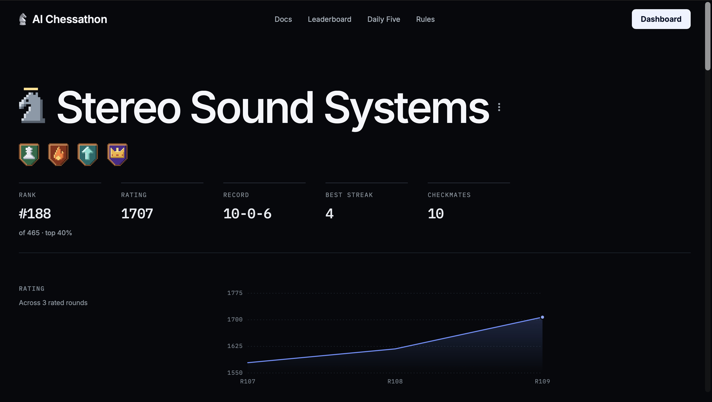
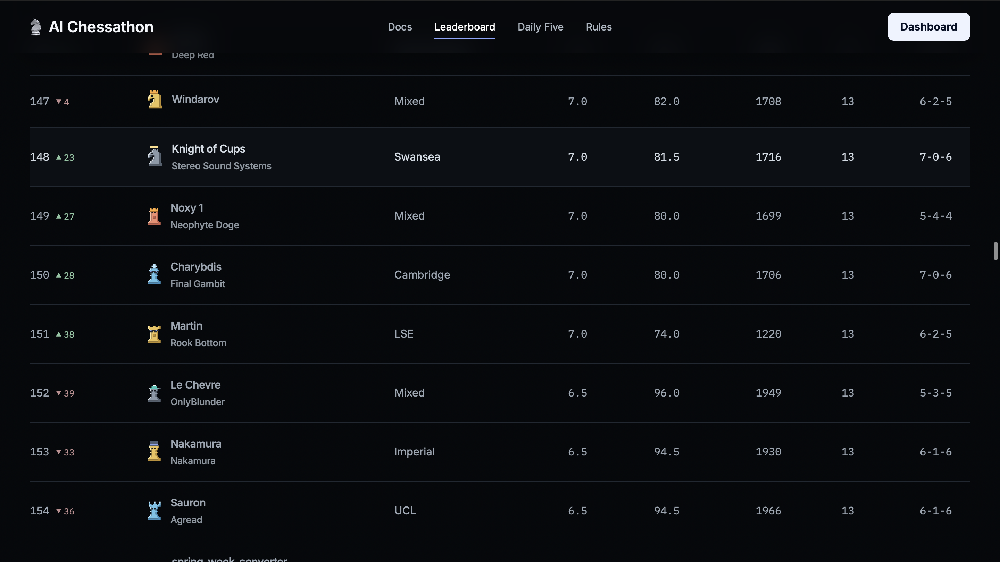

# AI Chess Hackathon Sponsored by Optiver

My submission for an AI Chess Hackathon, my submission was ranked top 30% (out of 465).

This repository is forked from [advitrocks9/aichessathon-starter](https://github.com/advitrocks9/aichessathon-starter).

## Unorthodox features

Because I found out about the competition the night before the finals, I had no practice
rounds and thought of drawing up more unconventional strategies to try and gain an edge. I got 3 main ideas looking at some of the games and the initial code.

**Opponent clock estimation.** The agent process is suspended while the opponent thinks,
so there is no way to observe them directly. But `time.monotonic()` is wall clock and
keeps running through suspension, so recording it at the end of one move and the start of
the next recovers the opponent's think time. Accumulated across the game against the known
120s + 0.5s time control, that gives a running estimate of their remaining clock. On the
competition hardware it tracked the referee's own figures to within about 15ms per move.

**Flag pressure.** The estimator feeds a behaviour change. When the opponent is short of
time and we are not, keeping material on the board is scored as good: complications are
harder for them to navigate under time pressure, and our own search gets cheaper as pieces
come off, so the trade is doubly in our favour.

**Contempt and repetition tracking.** The agent only receives positions where it is to
move, so it accumulates its own position history to know when it is walking into a
repetition the referee would claim automatically. A draw is then scored slightly against
the root side, which pushes the engine away from trading into sterile equality. Across 29
rated games the agent drew none of them, in a field where the leading teams drew half.

## Main features/approach

A classical alpha-beta engine on top of python-chess. Everything is written from
ordinary chess principles; no third party engine, network, or tuned tables are used.

**Search.** Fail-soft negamax with alpha-beta and iterative deepening, over a
transposition table that persists for the whole game. Null-move pruning, check
extensions, late move reductions and late move pruning, futility and reverse futility
pruning, aspiration windows, and principal variation search. Quiescence runs over
captures, filtered by static exchange evaluation and delta pruning.

**Move ordering.** Hash move, then winning and equal captures by MVV-LVA, then killer
moves, then quiet moves by history heuristic, then losing captures last. Ordering is
worth more than anything else in the search at these node rates, so it got the most
attention.

**Evaluation.** Material, hand-written piece-square tables tapered between midgame and
endgame, passed pawns scaled by rank, connected passers, doubled and isolated pawns,
bishop pair, rooks on open files, a pawn shield in front of the king, and light mobility.
The passed pawn terms came from reading games off the leaderboard, where two of the three
I studied were decided by a pawn race.

**Time.** A soft budget stops new iterations and a hard budget aborts mid-search, falling
back to the last completed iteration via an exception raised from the search. A forced
mate returns immediately rather than spending the rest of the budget re-proving it. All
table building and a warm-up search happen at import, inside the free 90s init budget
rather than on the match clock.

**Safety.** The whole of `get_move` is wrapped so any exception falls through to a legal
move rather than a crash, and the chosen move is validated against the legal move list
before it is returned. A crash or an illegal move loses the game outright, and a real
share of the field lost games that way.

## The rules

The competition rules are at [aichessathon.com/docs](https://aichessathon.com/docs).
